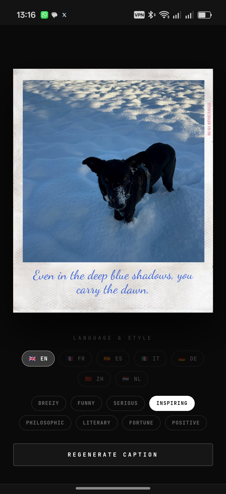

# Instanza 📸

Instanza is an avant-garde web application that captures moments and transforms them into poetic, vintage-style Polaroid memories. Powered by Google Gemini AI, it analyzes the mood of your photos and rescribes them with soulful, handwritten captions.



## Features

- **Analog Essence**: A custom-engineered canvas engine that applies vintage filters, vignettes, and a physical Polaroid frame to your digital shots.
- **AI-Driven Poetry**: Uses Google Gemini Pro Vision to "see" your image and generate context-aware, poetic captions in multiple styles and languages.
- **Digital Date Stamping**: Every photo is vertically stamped with a retro-red digital timestamp, preserving the exact moment in time.
- **Micro-Interactions**: A sleek, dark-mode interface with elegant transitions and a "developing" animation that mimics the analog experience.
- **Seamless Sharing**: Save your developed Polaroids directly to your device or share them with the world.

## Tech Stack

- **Core**: React 19, TypeScript
- **Styling**: Tailwind CSS 4 (PostCSS)
- **Build Tool**: Vite 6
- **AI Integration**: Google Generative AI (Gemini)
- **Image Processing**: HTML5 Canvas with custom filter pipelines

## Installation & Setup

### 1. Clone the repository
```bash
git clone https://github.com/Toeron/Instanza.git
cd Instanza
```

### 2. Install dependencies
```bash
npm install
```

### 3. Configure Environment Variables
Create a `.env` file in the root directory and add your Google Gemini API Key:
```env
# You can use either GOOGLE_API_KEY or GEMINI_API_KEY
GOOGLE_API_KEY="your_api_key_here"
```

### 4. Run the Development Server
```bash
npm run dev
```
Open [http://localhost:3000](http://localhost:3000) in your browser.

## How it Works

1. **Capture**: Use the viewfinder to take a live photo or upload an existing one.
2. **Analysis**: The Gemini AI analyzes the visual elements, lighting, and mood.
3. **Rescribing**: A handwritten-style caption is generated and "inked" onto the Polaroid frame.
4. **Development**: The image goes through an analog processing phase with color grading and texture application.
5. **Final Result**: Your high-resolution Polaroid is ready for download.

---
Built with ❤️ by Toeron
